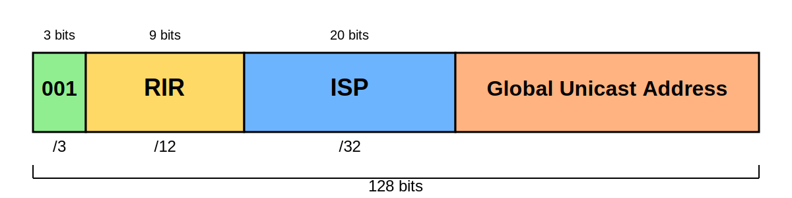

<!-- _class: lead -->

# IPv6 Training
## Fundamentals to Deployment

**Presenter:** Terry Sweetser
**Date:** October 2025

---

<!-- _class: lead -->

## Module 1:
# Introduction to IPv6

---

# Why IPv6? Key Improvements

-   **Address Space:** Massive increase from 32-bit (IPv4) to 128-bit.
-   **Management:** Built-in Stateless Address AutoConfiguration (SLAAC) simplifies network setup.
-   **Performance:**
    -   Simplified header for more efficient packet processing.
    -   No header checksum re-calculation at every router hop.
-   **Fragmentation:** Handled by the source host using Path MTU Discovery (PMTUD).

---

# A Simplified, More Efficient Header


**Key Takeaway:** IPv6 removes unnecessary fields, making the header stream-lined and faster for routers to process.

---
<style scoped>section{font-size:27px;}</style>

# Vastly Larger Address Space


**IPv6 Address Size:** 128 bits

**Total Available Addresses:**
2<sup>128</sup> ≈ 340 undecillion (3.4 x 10<sup>38</sup>)

Written in hexadecimal format for readability.

More addresses than grains of sand on ALL of Earth's beaches

---

# IPv6 Address Representation

An IPv6 address consists of eight 16-bit blocks called **hextets**.
Each hextet is represented by four hexadecimal digits.
Hextets are separated by colons (`:`).

**Example:**

```2001:0db8:85a3:08d3:1319:8a2e:0370:7344```

---

# Abbreviation Rule 1: Omitting Leading Zeros

Leading zeros within any hextet can be omitted.

-   `0db8` becomes `db8`
-   `0000` becomes `0`
-   `0370` becomes `370`

**Original:** `2001:0db8:0000:0000:0000:8a2e:0370:7334`
**Simplified:** `2001:db8:0:0:0:8a2e:370:7334`

---

# Abbreviation Rule 2:<br>The Double Colon

A single, contiguous block of all-zero hextets can be replaced with a double colon (`::`).

**Important:** The double colon (`::`) can only be used **ONCE** in an address to avoid ambiguity.

**Original:** `2001:db8:0:0:0:8a2e:370:7334`
**Fully Compressed:** `2001:db8::8a2e:370:7334`

---
<style scoped>section{font-size:30px;}</style>

# Abbreviation Best Practices

To ensure a canonical, consistent text representation:
1.  The `::` should be used to compress the **longest** run of consecutive 16-bit fields of zeros.
2.  If the runs of zeros are of equal length, the **first** run should be compressed.

**Example:** `2001:db8:0:0:1:0:0:1` becomes `2001:db8::1:0:0:1` (not `2001:db8:0:0:1::1`)

<a href="https://www.rfc-editor.org/rfc/rfc5952" class="rfc-chip" target="_">RFC 5952</a>

---
<style scoped>section{font-size:33px;}</style>

# Prefix Representation (CIDR Notation)

IPv6 uses CIDR notation to define the network portion of an address.

**Format:** `ipv6-address/prefix-length`

The prefix length indicates how many bits belong to the network.

**Examples:**
-   `2001:db8::/32` (A large block for an ISP)
-   `2001:db8:1234::/48` (A typical site prefix)
-   `2001:db8:1234:0001::/64` (A single subnet)

---

<!-- _class: lead -->

## Module 2:
# IPv6 Address Types and Structure

---
<style>
.custom-callout {
  position: absolute;
  bottom: 75px;
  right: 75px;
  float: right;
  width: 333px;
  padding: 15px;
  margin-left: 20px;
  border-radius: 10px;
  background-color: #f0f0f0;
  box-shadow: 2px 2px 5px rgba(0, 0, 0, 0.2);
  color: #333;
}

.custom-callout h3 {
  margin-top: 0;
  color: #0056b3;
}
</style>

# Overview of IPv6 Address Types


<br/>
<br/>
<br/>
<br/>
<br/>
<br/>
<br/>
<br/>
<p>What is missing? And why?</p>

---

# IPv6 Addressing Models

-   **Unicast:** One-to-One. Identifies a single interface.
-   **Multicast:** One-to-Many. Identifies a group of interfaces. A packet is delivered to all group members.
-   **Anycast:** One-to-Nearest. Identifies a set of interfaces. A packet is delivered to the *closest* one (as determined by routing).

---

# Special Unicast Addresses

-   **Unspecified Address:** `::/128`
    -   Represents the absence of an address. Used as a source address by a host that does not yet have an address.
-   **Loopback Address:** `::1/128`
    -   Used by a host to send a packet to itself for testing the TCP/IP stack. Equivalent to `127.0.0.1` in IPv4.

---
<style scoped>section{font-size:24px;}</style>

# IPv6 Multicast Scope Reference

## Multicast Address Format

IPv6 multicast addresses use the format: **ffXY::/8**

- **ff** = Multicast prefix (fixed)
- **X** = Flags field
- **Y** = Scope field

## Flags Field (X)

| Flag Value | Meaning |
|------------|---------|
| 0 | Well-Known (permanently assigned) |
| 1 | Transient (temporarily assigned) |

---
<style scoped>section{font-size:17px;}</style>

## Scope Field (Y) - Complete Reference

| Scope Value | Scope Name | Address Format | Description | Boundary |
|-------------|------------|----------------|-------------|----------|
| 0 | Reserved | ff0X:: | Not used | N/A |
| 1 | Interface-Local | ff01:: / ff11:: | Limited to a single network interface | Single interface |
| 2 | Link-Local | ff02:: / ff12:: | Limited to the local network link (same subnet) | Single link/subnet |
| 3 | Realm-Local | ff03:: / ff13:: | Reserved for future use | Reserved |
| 4 | Admin-Local | ff04:: / ff14:: | Defined by local network administrators | Administrative boundary |
| 5 | Site-Local | ff05:: / ff15:: | Limited to a single site or organization campus | Single physical site |
| 6 | (Unassigned) | ff06:: / ff16:: | Not assigned | N/A |
| 7 | (Unassigned) | ff07:: / ff17:: | Not assigned | N/A |
| 8 | Organization-Local | ff08:: / ff18:: | Spans multiple sites within an organization | Organization-wide |
| 9-D | (Unassigned) | ff09-0D:: | Not assigned | N/A |
| E | Global | ff0e:: / ff1e:: | No boundary restrictions, internet-wide | Global/Internet |
| F | Reserved | ff0f:: / ff1f:: | Reserved for future use | N/A |

---
<style scoped>section{font-size:21px;}</style>

## Common Multicast Addresses Examples

| Address | Scope | Description |
|---------|-------|-------------|
| ff02::1 | Link-Local | All nodes on the local link |
| ff02::2 | Link-Local | All routers on the local link |
| ff02::1:ff00:0/104 | Link-Local | Solicited-node multicast addresses |
| ff05::1:3 | Site-Local | All DHCP servers within site scope |
| ff0e::101 | Global | All NTP servers (global scope) |

## Scope Hierarchy (Smallest to Largest)

1. **Interface-Local (1)** - Single interface only
2. **Link-Local (2)** - Single network segment
3. **Admin-Local (4)** - Administrator-defined
4. **Site-Local (5)** - Single physical location
5. **Organization-Local (8)** - Multiple sites in organization
6. **Global (E)** - Entire Internet

<div class="custom-callout">
  <h3>QUESTION</h3><p>Could you really multicast to the WHOLE INTERNET?</p>
</div>

---
<style scoped>section{font-size:30px;}</style>

# Global Unicast Addresses (GUA)

-   Globally unique and routable on the public internet.
-   Equivalent to public IPv4 addresses.
-   Currently, IANA only assigns GUAs from the `2000::/3` address block (addresses starting with binary `001`).



---
<style>
.rfc-chip { display: inline-block; background: rgba(255, 255, 255, 0.95); color: #4f46e5; padding: 8px 20px; border-radius: 20px; font-size: 0.95em; font-weight: 600; text-decoration: none; border: 2px solid #4f46e5; transition: all 0.3s ease; cursor: pointer; margin: 5px; }
.rfc-chip:hover { background: #4f46e5; color: white; transform: scale(1.05); box-shadow: 0 4px 12px rgba(79, 70, 229, 0.4); }
</style>
# GUA Allocation Hierarchy


<a href="https://www.rfc-editor.org/rfc/rfc4291" class="rfc-chip" target="_">RFC 4291</a>
<a href="https://www.rfc-editor.org/rfc/rfc2780" class="rfc-chip" target="_">RFC 2780</a>
<a href="https://www.rfc-editor.org/rfc/rfc1881" class="rfc-chip" target="_">RFC 1881</a>

---
<style scoped>section{font-size:24px;}</style>

# IPv6 Addressing Structure


---

# Link-Local Unicast Addresses

-   **Prefix:** `FE80::/10`
-   Automatically configured on every IPv6-enabled interface.
-   **Not routable.** Scope is limited to a single network segment (link).
-   Used for Neighbor Discovery and as the next-hop address by routers.

<i>Self-generated so nodes can 'fast start' local IPv6 operations.</i>

---
<style scoped>section{font-size:27px;}</style>

# Zone IDs for Link-Locals

Since all devices on a network have a link-local address starting with `FE80`, the Zone ID specifies *which interface* to use.

Appended to the address with a `%` character.

-   **Example (macOS/Linux):**
    ```bash
    ping fe80::aede:48ff:fe00:12%en0
    ```
-   **Example (Windows):**
    ```bash
    ping fe80::aede:48ff:fe00:12%15
    ```

---

# Unique Local Unicast Addresses (ULA)

-   **Prefix:** `FC00::/7`
-   The equivalent of RFC 1918 private IPv4 addresses.
-   Routable within a site or between a limited number of sites.
-   **Not routable** on the global internet.

---
<style>
.rfc-chip { display: inline-block; background: rgba(255, 255, 255, 0.95); color: #4f46e5; padding: 8px 20px; border-radius: 20px; font-size: 0.95em; font-weight: 600; text-decoration: none; border: 2px solid #4f46e5; transition: all 0.3s ease; cursor: pointer; margin: 5px; }
.rfc-chip:hover { background: #4f46e5; color: white; transform: scale(1.05); box-shadow: 0 4px 12px rgba(79, 70, 229, 0.4); }
</style>

# Modified EUI-64 Format


A method for a device to auto-generate its unique 64-bit Interface ID from its 48-bit MAC address.

<a href="https://www.rfc-editor.org/rfc/rfc7136" class="rfc-chip" target="_">RFC 7136</a>

---
<style>
.rfc-chip { display: inline-block; background: rgba(255, 255, 255, 0.95); color: #4f46e5; padding: 8px 20px; border-radius: 20px; font-size: 0.95em; font-weight: 600; text-decoration: none; border: 2px solid #4f46e5; transition: all 0.3s ease; cursor: pointer; margin: 5px; }
.rfc-chip:hover { background: #4f46e5; color: white; transform: scale(1.05); box-shadow: 0 4px 12px rgba(79, 70, 229, 0.4); }
</style>

# Privacy Extensions for IPv6

<a href="https://www.rfc-editor.org/rfc/rfc4941" class="rfc-chip" target="_">RFC 4941</a>

EUI-64 creates a static Interface ID based on the hardware MAC address, which is a privacy concern (device tracking).

-   **Privacy Extensions** solve this by generating temporary, randomized Interface IDs for outgoing connections.
-   These temporary addresses change periodically.
-   Most modern operating systems enable this by default.

---

# Well-Known Multicast Addresses

-   **All Nodes Multicast:** `FF02::1`
    -   Every IPv6-enabled device joins this group on a link.
-   **All Routers Multicast:** `FF02::2`
    -   Every IPv6 router joins this group on a link.
-   **Solicited-Node Multicast:** `FF02::1:FFxx:xxxx`
    -   Used for address resolution (the IPv6 version of ARP).
    -   Each device joins a **unique solicited-node group for each of its unicast addresses**.

---
<style scoped> table {font-size:12px;}</style>

# Special-Purpose Address Allocations

| Prefix | Name | Purpose | RFC |
|--------|------|---------|-----|
| `::/0` | Default Route | Routing table default | RFC 4291 |
| `::` | Unspecified | No address assigned | RFC 4291 |
| `::1` | Localhost | Loopback interface | RFC 4291 |
| `::ffff:0:0/96` | IPv4-Mapped | IPv4 addresses mapped to IPv6 | RFC 4291 |
| `64:ff9b::/96` | Well-Known Prefix | NAT64/DNS64 translation | RFC 6052 |
| `64:ff9b:1::/48` | Local NAT64 | Site-local NAT64 translation | RFC 8215 |
| `100::/64` | Discard-Only | Remote triggered black hole | RFC 6666 |
| `2001::/32` | TEREDO | Deprecated tunneling (was active) | RFC 4380 |
| `2001:1::1/128` | Port Control Protocol Anycast | PCP server discovery | RFC 7723 |
| `2001:1::2/128` | Traversal Using Relays NAT Anycast | TURN server discovery | RFC 8155 |
| `2001:2::/48` | Benchmarking | Network performance testing | RFC 5180 |
| `2001:3::/32` | AMT | Automatic Multicast Tunneling | RFC 7450 |
| `2001:4:112::/48` | AS112-v6 | DNS sinkhole service | RFC 7535 |
| `2001:10::/28` | ORCHID | Overlay Routable Cryptographic Hash IDs | RFC 7343 |
| `2001:20::/28` | ORCHIDv2 | Version 2 of ORCHID | RFC 7343 |
| `2001:db8::/32` | Documentation | Examples and documentation | RFC 3849 |
| `2002::/16` | 6to4 | Deprecated transition mechanism | RFC 3056 |
| `5f00::/16` | SRv6 SID | Segment Routing over IPv6 | RFC 8986 |
| `fc00::/7` | Unique Local | Private addressing | RFC 4193 |
| `fe80::/10` | Link-Local | Local link communication | RFC 4291 |
| `ff00::/8` | Multicast | Multicast addresses | RFC 4291 |

---

<!-- _class: lead -->

## Module 3:
# IPv6 Protocol and Operations

---
<style scoped>section{font-size:21px;}</style>

# IPv6 Protocol Header Format


-   **Version (4-bit):** Value is 6.
-   **Traffic Class (8-bit):** For QoS, similar to DiffServ.
-   **Flow Label (20-bit):** Identifies packets belonging to the same flow.
-   **Payload Length (16-bit):** Length of payload + extension headers.
-   **Next Header (8-bit):** Identifies the next header type.
-   **Hop Limit (8-bit):** Similar to TTL in IPv4.

---
<style scoped>section{font-size:21px;}</style>

# IPv6 Extension Headers

Optional headers placed between the main IPv6 header and the upper-layer payload. Allows for new features without changing the core protocol.


---
<style scoped>section{font-size:24px;}</style>

# Extension Header Order

When multiple extension headers are used, they should appear in this recommended order:

1.  **IPv6 header**
2.  Hop-by-Hop Options
3.  Destination Options (for intermediate destinations)
4.  Routing header
5.  Fragment header
6.  Authentication Header (AH)
7.  Encapsulating Security Payload (ESP)
8.  Destination Options (for final destination)
9.  **Upper-Layer header** (e.g., TCP/UDP)

<a href="https://www.rfc-editor.org/rfc/rfc8200" class="rfc-chip" target="_">RFC 8200</a>

---

# Fragmentation Handling in IPv6

-   **Performed only by the source host**, not by routers in the path.
-   If a router receives a packet that is too large for the next link, it drops the packet.
-   It then sends an ICMPv6 "Packet Too Big" message back to the source.
-   This process is called Path MTU Discovery (PMTUD).

<a href="https://www.rfc-editor.org/rfc/rfc8201" class="rfc-chip" target="_">RFC 8201</a>

---
<style scoped>section{font-size:24px;}</style>

# Path MTU Discovery (PMTUD)


---
<style scoped>section{font-size:30px;}</style>

# ICMPv6 Neighbor Discovery (ND)

Replaces ARP, ICMP Router Discovery, and ICMP Redirect in IPv4.

-   **Router Solicitation (RS):** Host asks for a router.
-   **Router Advertisement (RA):** Router announces its presence, prefixes, and other parameters.
-   **Neighbor Solicitation (NS):** Like an ARP request, asks for a host's link-layer (MAC) address.
-   **Neighbor Advertisement (NA):** Like an ARP reply, provides a link-layer address.

<a href="https://www.rfc-editor.org/rfc/rfc4861" class="rfc-chip" target="_">RFC 4861</a>

---

# IPv6 Address Auto-configuration

-   **Stateless (SLAAC):**
    -   No manual configuration needed.
    -   Host learns the prefix from a Router Advertisement (RA).
    -   Host generates its own Interface ID (e.g., using EUI-64 or Privacy Extensions).
-   **Stateful (DHCPv6):**
    -   A DHCPv6 server tracks and assigns addresses and other parameters.

---
<style scoped>section{font-size:27px;}</style>

# SLAAC Process

1.  Host generates a link-local address and performs Duplicate Address Detection (DAD).
2.  Host sends a Router Solicitation (RS) to the `all-routers` multicast group.
3.  A router on the link responds with a Router Advertisement (RA) containing the network prefix.
4.  The host combines the prefix from the RA with its self-generated Interface ID to form a global address.

<a href="https://www.rfc-editor.org/rfc/rfc4862" class="rfc-chip" target="_">RFC 4862</a><a href="https://www.rfc-editor.org/rfc/rfc6957" class="rfc-chip" target="_">RFC 6957</a>

---
<style scoped>section{font-size:30px;}</style>

# DHCPv6 and RA Flags

Router Advertisements have flags to tell hosts how to get addresses:

-   **`A` Flag (Autonomous):** On by default. Tells hosts they can use SLAAC.
-   **`M` Flag (Managed):** If set, tells hosts to get their address and all other info from a DHCPv6 server (**Stateful DHCPv6**).
-   **`O` Flag (Other):** If set (and M is not), tells hosts to use SLAAC for their address, but get other info (like DNS servers) from DHCPv6 (**Stateless DHCPv6**).

<a href="https://www.rfc-editor.org/rfc/rfc8415" class="rfc-chip" target="_">RFC 8415</a>

---
<style scoped>section{font-size:21px;}</style>

# Modern IPv6 Router Advertisement Options

| **Option** | **Purpose** | **RFC** | **Type** |
|------------|-------------|---------|----------|
| **RDNSS** (Recursive DNS Server) | Advertise DNS resolver addresses | RFC 8106 | 25 |
| **DNSSL** (DNS Search List) | Advertise DNS search domains | RFC 8106 | 31 |
| **Route Information** | Advertise more-specific routes | RFC 4191 | 24 |
| **RA Flags Extension** | Expand available flag bits beyond M/O flags | RFC 5175 | 26 |
| **Captive Portal** | Notify clients of captive portal presence | RFC 8910 | 37 |
| **PREF64** | Advertise NAT64 prefix for IPv6-only networks | RFC 8781 | 38 |
| **6RD** (IPv6 Rapid Deployment) | Distribute 6RD configuration parameters | RFC 5969 | - |

<div class="custom-callout">
  <h3>QUESTION</h3><p>Can you have a no-DHCP network and still have working internet access?</p>
</div>

<a href="https://www.ietf.org/archive/id/draft-link-v6ops-6mops-01.html" class="rfc-chip" target="_">link-v6ops-6mops-01</a>

---
<style scoped>section{font-size:27px;}</style>

# Stateful DHCPv6 Process

The 4-step "SORA" process:

1.  **Solicit:** Client sends a message to the `All_DHCP_Relay_Agents_and_Servers` multicast address (`FF02::1:2`) to find a DHCPv6 server.
2.  **Advertise:** Available servers respond with an advertisement, offering an address.
3.  **Request:** Client chooses a server and sends a request to formally ask for the offered address.
4.  **Reply:** Server confirms the assignment and sends a reply with the address and other configuration parameters.

---
<style scoped>section{font-size:21px;}</style>

# IPv6 Source Address Selecion

| Rule | Do what? |
|------|-------------------------------------------------------------------------------------------------------------------------|
| 1    | Prefer same address - if destination is one of node's addresses, use it |
| 2    | Prefer appropriate scope - match scope of source to destination (link-local to link-local, global to global) |
| 3    | Avoid deprecated addresses - don't use addresses marked as deprecated |
| 4    | Prefer home addresses - for Mobile IPv6 |
| 5    | Prefer outgoing interface - use address from the interface the packet will exit |
| 6    | Prefer matching label - use policy table to match address labels |
| 7    | Prefer temporary addresses - favor privacy addresses for privacy reasons (or prefer public addresses for server use) |
| 8    | Use longest matching prefix - choose source address with longest common prefix with destination |

<a href="https://www.rfc-editor.org/rfc/rfc6724" class="rfc-chip" target="_">RFC 6724</a>

---

<!-- _class: lead -->

## Module 4:
# IPv6 Address Planning

---

# A Shift in Mindset

## IPv4: Number of Hosts
We are constrained by a lack of addresses. The goal is to conserve IPs.

## IPv6: Number of Subnets!
Addresses are abundant. The goal is to design a logical, hierarchical, and scalable subnetting plan.

---

# High-Level Allocation Strategy

-   **RIRs** allocate `/32` blocks (or larger) to Network Operators / ISPs.
-   **Global Routing Prefix** for an organization is typically `/48`.
    -   A `/48` provides 65,536 subnets (`/64`s).
-   **Best Practice:** Do not use prefixes longer than `/48` in global routing tables.
-   **End Site Subnet:** Always use a `/64` for any LAN segment where hosts reside.

---
<style scoped>section{font-size:30px;}</style>

# ISP Infrastructure Address Plan

Dedicate a block of your main allocation for internal infrastructure.

-   **Backbone Infra:** Dedicate a `/40` or `/48`.
    -   This block is carried by your Interior Gateway Protocol (IGP), not iBGP.
-   **Sub-allocate from this block for:**
    -   Loopbacks (`/128` addresses)
    -   Point-to-Point links (`/64` networks) (not `/126`)
    -   Internal Server LANs (NOC LAN) -- maybe LUA
    -   External Server LANs (Mail, DNS) -- firewalled GUA
-   **Everyone** just gets a `/64`: Yes? No?

---
<style scoped>section{font-size:27px;}</style>

# Planning for Enterprise Customers

-   **Avoid `/64` for end sites!** A single `/64` gives a customer only one subnet, which is not scalable.
-   **Best Practice:** Assign enough address space for future growth.
-   **Typical Assignments:**
    -   `/48`: Standard for most business customers. Allows for 65k subnets.
    -   `/52` or `/56`: For mid-sized customers.
    -   Remember subnet by <a href="https://en.wikipedia.org/wiki/Nibble" class="rfc-chip" target="_">Nibbles</a>
    -   `/60`: For very small customers.

<a href="https://www.rfc-editor.org/rfc/rfc6177" class="rfc-chip" target="_">RFC 6177</a>

---
<style scoped>section{font-size:27px;}</style>

# Planning for Broadband Customers

-   **WAN Link:** A `/64` prefix is used for the link between the CPE and the BNG (for SLAAC).
-   **LAN Side:** Use DHCPv6 Prefix Delegation (DHCPv6-PD).
    -   The ISP's BNG "delegates" a prefix to the customer's CPE router.
    -   Typical delegation size is `/48`, `/56`, or `/60`.
-   The CPE then uses this delegated prefix to create `/64` subnets for the home LAN(s).
-   Best policy is to make assignments static.  Some jurisdictions have data retention laws.

<a href="https://www.rfc-editor.org/rfc/rfc8415" class="rfc-chip" target="_">RFC 8415</a>

---
<style scoped>section{font-size:21px;}</style>

# Routing Plan: No Leaks

-   **IGP (e.g., OSPFv3, IS-IS):**
    -   Carries infrastructure blocks (Point-to-Points, loopbacks).
    -   Aggregation is highly desirable to keep the IGP routing table small.
    -   **Avoid route leaks:** IGP never redistributes from any BGP!
-   **iBGP:**
    -   Carries all customer prefixes (where they have ASNs and are downstream.)
    -   **Avoid route leaks:** iBGP never redistributes from your IGP.
-   **eBGP:**
    -   Announce aggregated prefixes **only** to the internet.
    -   Aggregation is necessary to maintain a stable global routing table.
    -   **Routing Security:** deploy ROV, only announce signed routes.
-   **Default Free Zone**:
    -   No default routes on borders --> drop traffic with no destination.
    -   Consider morphing ROV INVALIDS into discard routes.

---

<!-- _class: lead -->

## Module 5:
# IPv6 Transition and Deployment

---

# Dual Stack


The most common transition mechanism. Nodes run both IPv4 and IPv6 protocol stacks simultaneously.

-   **Pro:** Native access to both IPv4 and IPv6 content.
-   **Con:** Does not solve the IPv4 address depletion issue. You still need a public (or CG-NAT) IPv4 address.

---
<style scoped> table {font-size:14px;}</style>

# Transition Technologies

| Technology | RFC | Date Published | Current Status | Deployment Estimation |
|------------|-----|----------------|----------------|----------------------|
| **6to4** | RFC 3056 | 2001 | Deprecated (RFC 7526, 2015) | Largely discontinued; was widely used 2005-2015 |
| **Teredo** | RFC 4380 | 2006 | Deprecated; disabled in modern Windows | Minimal usage; Microsoft disabled by default in Windows 10+ |
| **ISATAP** | RFC 5214 | 2008 | Deprecated; disabled in modern Windows | Minimal usage; primarily enterprise legacy |
| **Dual Stack** | RFC 4213 | 2005 | Active, recommended | Primary deployment method; ~40-50% of networks globally |
| **NAT64/DNS64** | RFC 6146/6147 | 2011 | Active, widely used | Common in mobile networks; ~20-30% of mobile carriers |
| **DS-Lite** | RFC 6333 | 2011 | Active | Moderate; popular in Japan, some European ISPs (~10-15%) |
| **464XLAT** | RFC 6877 | 2013 | Active, growing | Very common in mobile; ~60-70% of LTE/5G networks |
| **MAP-E** | RFC 7597 | 2015 | Active | Moderate; popular in Japan (~5-10% globally) |
| **MAP-T** | RFC 7599 | 2015 | Active | Limited; similar deployment to MAP-E |
| **6rd** | RFC 5969 | 2010 | Active | Declining; was popular 2010-2015 (~5% current) |
| **Lightweight 4over6** | RFC 7596 | 2015 | Active | Limited deployment, mainly China (~2-5%) |

---
<style scoped>section{font-size:27px;}</style>

# Transition Technologies

**Notes:**

- RFC 9313 examines the five most prominent IPv4aaS technologies (DS-Lite, 464XLAT, MAP-E, MAP-T, and Lightweight 4over6)
- Deployment numbers are estimates based on industry reports and vary significantly by region
- 6to4 and Teredo were once common but security concerns led to deprecation
- 464XLAT is currently the dominant mobile carrier solution
- Dual Stack remains the most straightforward approach where IPv4 addresses are still available

<a href="https://www.rfc-editor.org/rfc/rfc9313" class="rfc-chip" target="_">RFC 9313</a>

---
<style scoped>section{font-size:33px;}</style>

# DS-LITE


Before 464XLAT, used ipv4 in ipv6 tunnels for transport over ipv6-only core networks.  Supported on many CGN appliances. 

<a href="https://www.rfc-editor.org/rfc/rfc6333" class="rfc-chip" target="_">RFC 6333</a>

---
<style scoped>section{font-size:27px;}</style>

# IPv6-Only with NAT64 + DNS64

Allows IPv6-only clients to access the IPv4 internet.

1.  **DNS64:** When an IPv6-only client requests an `A` record (IPv4), the DNS64 server synthesizes an `AAAA` record (IPv6) by prepending a special NAT64 prefix.
2.  **NAT64:** The client sends its packet to this synthesized IPv6 address. The NAT64 gateway receives it, translates the packet to IPv4, and forwards it to the IPv4 internet.

**Note: CGN aka NAT444 and NAT64 can co-exist, with support on many CGN appliances.**

---
<style scoped>section{font-size:27px;}</style>

# 464XLAT Architecture


A mechanism to provide IPv4 connectivity on an IPv6-only network, commonly used in mobile networks.

-   **CLAT (Client-side Translator):** A function on the end-host (e.g., smartphone) that translates private IPv4 from applications into IPv6.
-   **PLAT (Provider-side Translator):** A stateful NAT64 gateway in the provider's network that translates the IPv6 traffic back to public IPv4.

<a href="https://www.rfc-editor.org/rfc/rfc6145" class="rfc-chip" target="_">RFC 6145</a><a href="https://www.rfc-editor.org/rfc/rfc6146" class="rfc-chip" target="_">RFC 6146</a>

---

# IPv6 and Mobile Devices

-   **Android:** Supports 464XLAT natively since version 4.4 (KitKat).
    -   Recently relented and will soon support DHCPv6-PD.
-   **iOS:**
    -   Supported IPv6 over mobile interface since iOS 9.
    -   Since June 2016, all apps submitted to the App Store **must** support IPv6-only networks.

---

# IPv6 and Enterprises, Desktops, etc

Overall, IPv6 coverage has been effectively 100% for the last 15 years on provider and enterprise hardware.

-  **Windows**: since 2000 plus all versions since!
-  **macOS**: since 2003 (Panther 10.3) with working CLAT
-  **Linux**: since 2.6 in 2003, testing started in 1996!

---
<style scoped>section{font-size:21px;}</style>

# Deployment Planning Steps

1.  **Assess Your Network:**
    -   Do existing nodes (routers, switches, firewalls) support IPv6?
    -   What requires a software update vs. a hardware replacement?
2.  **Clean Up Your Network:**
    -   Remove unused configs, interfaces, etc. Don't carry legacy mistakes into your new deployment.
3.  **Get an IPv6 Address Block and Create a Plan:**
    -   Request a `/48` (or larger) from your ISP/RIR.
    -   Use the principles from Module 4 to create a detailed address plan.
4.  **Assess Skills:**
    -   Do you have in-house skills or need consulting/training?
5.  **Deploy in Phases:**
    -   Start from the core/backbone and move outwards.
    -   Deploy services like email and dns on ipv6.
    -   Deploy for enterprise customers.
    -   Deploy in the access network (Broadband/Mobile).

---

<!-- _class: lead -->

# Questions?

